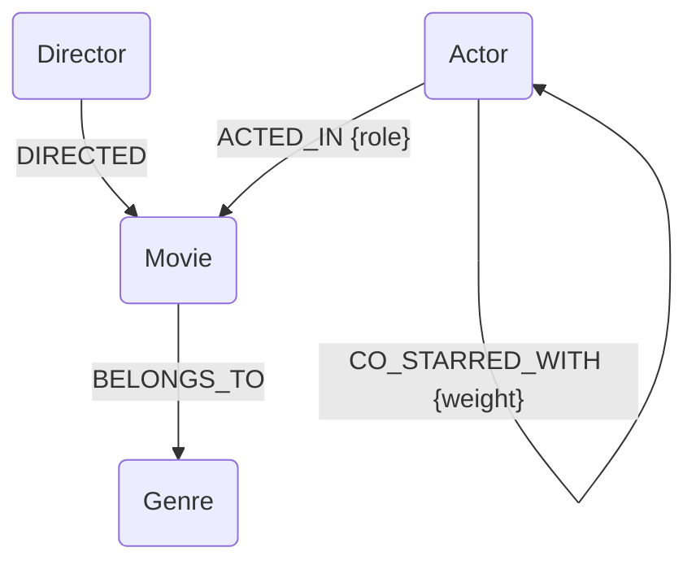

# CineGraph — Film & Actor Network Explorer

Build a functional web application backed by **CognoDB Cloud** (managed graph database) to explore deep connections in Hollywood.

---

## 🎬 Why a Graph Database?

Discovering relationships like *"Which actors are connected through shared co-stars?"* or *"What movies are directed by people who frequently collaborate with actor X?"* requires multi-hop path traversals.

In a **Relational (SQL) Database**, this requires complex, slow self-joins or recursive Common Table Expressions (CTEs):
```sql
-- Hard-coded 2-hop self-join to find co-stars in SQL:
SELECT DISTINCT a2.name FROM cast c1
JOIN cast c2 ON c1.movie_id = c2.movie_id
JOIN actor a2 ON c2.actor_id = a2.id
WHERE c1.actor_id = 123 AND a2.id <> 123;
```

In **CognoDB (Cypher)**, we can express the exact same relationship intuitively and execute it highly optimized without join-bloat:
```cypher
-- Expressed natively as a path in Cypher:
MATCH (a:Actor {id: $id})-[:ACTED_IN]->(m:Movie)<-[:ACTED_IN]-(co:Actor)
RETURN co.name, count(m) AS movies_together;
```

---

## 📊 Graph Data Model

The application uses the following graph schema:



### Node Labels
- `Movie` — Attributes: `id` (Unique), `title`, `year`, `rating`, `overview`
- `Actor` — Attributes: `id` (Unique), `name`, `born`
- `Director` — Attributes: `id` (Unique), `name`, `born`
- `Genre` — Attributes: `name` (Unique)

### Relationship Types
- `ACTED_IN` (Actor → Movie) — Property: `role`
- `DIRECTED` (Director → Movie)
- `BELONGS_TO` (Movie → Genre)
- `CO_STARRED_WITH` (Actor ↔ Actor) — Property: `weight` (Shared movie count)

---

## ⚡ Key Graph Queries Used

### 1. Co-Stars Finder (2-hop traversal via Movie node)
Finds actors who have worked together on the same movies, sorted by count.
```cypher
MATCH (a:Actor {id: $id})-[:ACTED_IN]->(m:Movie)<-[:ACTED_IN]-(co:Actor)
RETURN co.id AS id, co.name AS name, count(m) AS movies_together
ORDER BY movies_together DESC LIMIT 8
```

### 2. Degrees of Separation (Shortest Path Traversal)
Finds the shortest path of connections linking any two actors through movies or directors.
```cypher
MATCH p = shortestPath((a1:Actor)-[:ACTED_IN|:DIRECTED*..10]-(a2:Actor))
WHERE toLower(a1.name) = toLower($start) AND toLower(a2.name) = toLower($end)
RETURN p
```

### 3. Movie Recommendation (2-hop overlap query)
Recommends movies sharing the same genres, ordered by overlap strength and rating.
```cypher
MATCH (m:Movie {id: $id})-[:BELONGS_TO]->(g:Genre)<-[:BELONGS_TO]-(rec:Movie)
WHERE rec <> m
RETURN rec.id AS id, rec.title AS title, count(g) AS common_genres
ORDER BY common_genres DESC, rec.rating DESC LIMIT 5
```

---

## 🚀 Setting Up CognoDB Cloud

1. **Sign Up**: Register at [console.cognodb.com/signup](https://console.cognodb.com/signup).
2. **Create Instance**: Click "Create Instance", select "c0 (Free)" tier, and choose your region.
3. **Download Credentials**: Copy the Connection URI (starts with `bolt+s://`) and password. Note: Password is shown only once!

---

## 🛠️ How to Run Locally

### 1. Clone & Install
```bash
git clone <your-repo>
cd wexa-ai-second-assignment/cinegraph
pip install -r requirements.txt
```

### 2. Set Up Credentials
Create a `.env` file in the `cinegraph` directory:
```env
COGNODB_URI=bolt+s://<your-instance-id>.databases.cognodb.com
COGNODB_PASSWORD=<your-saved-password>
COGNODB_USER=cognodb
```

### 3. Seed Database
Run the ingestion script to import the seed data into your CognoDB cloud instance:
```bash
python seed/seed.py
```

### 4. Run Application
```bash
python app.py
```
Open **`http://localhost:5000`** in your browser.
